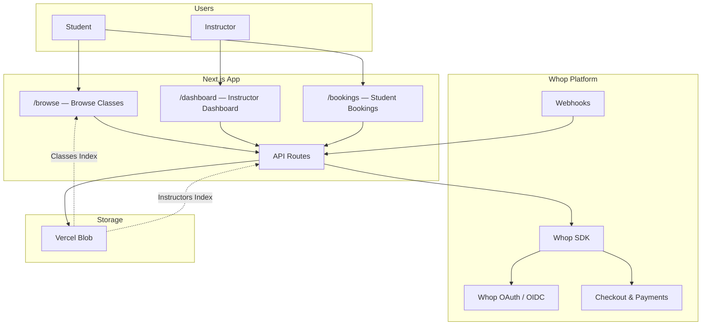
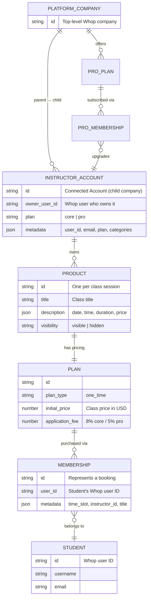
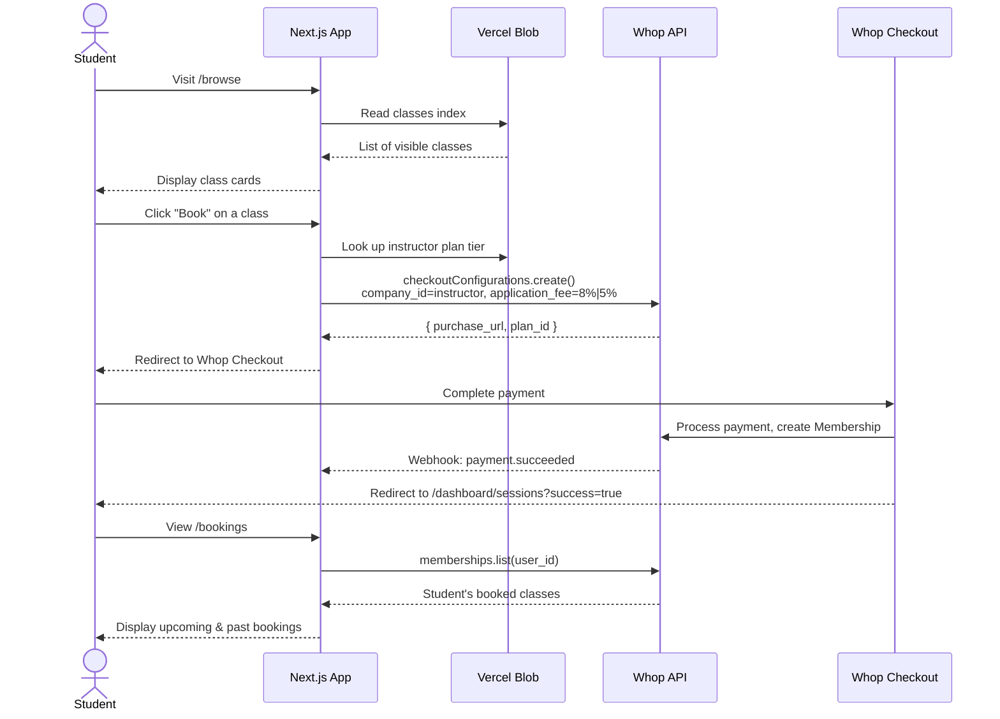
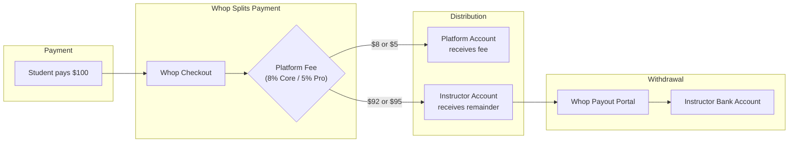

# Masterclass

A two-sided marketplace where instructors sell live classes and students book them — powered entirely by Whop for auth, payments, and payouts. No database required.

`Next.js 15` `Whop SDK` `Whop OIDC` `NextAuth v5` `Vercel Blob` `Tailwind CSS 4`

## Architecture Overview



The app is **standalone** (not embedded inside Whop). It uses Whop as its auth provider and payment backend. There is no traditional database — all persistent state lives in the Whop API (products, plans, memberships, companies) with Vercel Blob as a denormalized read cache.

## Whop Features Used

### Connected Accounts (Companies API)

Every instructor gets their own Whop company, created as a **child** of the platform company. This is the foundation of the two-sided marketplace — it enables each instructor to have their own products, plans, memberships, and payout balance.

- `companies.create` — Create a connected account on first sign-in
- `companies.list` — Find existing accounts by `parent_company_id`
- `companies.retrieve` / `companies.update` — Read and update instructor metadata (plan tier, categories)

### Products & Plans (Catalog API)

Each class session is a Whop **product**. Class metadata (date, time, duration, price) is stored as JSON in the product's `description` field, avoiding the need for a separate database.

- `products.create` / `products.update` — CRUD for class sessions
- `products.list` — Fetch an instructor's classes
- `plans.create` — Attach one-time pricing to a product

### Checkout with Application Fees

Booking a class creates a **checkout configuration** under the instructor's connected account. The platform takes a cut via `application_fee_amount` — 8% for Core instructors, 5% for Pro.

- `checkoutConfigurations.create` — Generate a payment link with split payments

### Memberships (Booking Verification)

A Whop **membership** is created when a student completes checkout. The app queries memberships to show booking history and count enrollments.

- `memberships.list` — List a student's bookings across all instructor accounts

### Embedded Payouts

Instructors manage their earnings through Whop's embedded payout components. The app generates scoped access tokens and portal URLs.

- `accessTokens.create` — Generate a token for the embedded payout UI (`BalanceElement`, `WithdrawButtonElement`, `WithdrawalsElement`)
- `accountLinks.create` — Generate a hosted payout portal URL

### OAuth / OIDC (Authentication)

Authentication uses Whop as an OIDC provider through NextAuth v5. A shared `@whop-examples/auth` package configures the Whop provider with PKCE.

- OIDC issuer: `https://api.whop.com`
- Token auth method: `none` (public client)
- ID token algorithm: `ES256`

### Webhooks

The app listens for Whop webhook events to handle plan tier changes and log payment activity.

- `payment.succeeded` / `payment.failed` — Persisted to blob for audit
- `membership.went_valid` — Upgrades instructor to Pro tier
- `membership.went_invalid` — Downgrades instructor to Core tier
- `payout.completed` — Persisted to blob for audit

## Data Model



Key insight: there is no `bookings` table. A **booking is a membership**. When a student pays for a class, Whop creates a membership under the instructor's connected account. The app queries memberships to reconstruct booking state.

## Setup

### 1. Clone and install

```bash
git clone https://github.com/whopio/whop-examples.git
cd whop-examples/web
pnpm install
```

### 2. Create a Whop App

1. Go to the [Whop Developer Dashboard](https://whop.com/apps)
2. Create a new app
3. Note your **App ID** (this is the OAuth `client_id`) and **API Key**
4. Set the authorized redirect URI:
   ```
   http://localhost:3001/api/auth/callback/whop
   ```

### 3. Configure environment variables

Create `web/apps/masterclass/.env.local`:

```env
# Required
WHOP_API_KEY=your_whop_api_key
AUTH_SECRET=any_random_string_for_nextauth
BLOB_READ_WRITE_TOKEN=your_vercel_blob_token
NEXT_PUBLIC_WHOP_APP_ID=your_whop_app_id
NEXT_PUBLIC_WHOP_COMPANY_ID=your_whop_company_id
NEXT_PUBLIC_APP_URL=http://localhost:3001

# Optional — needed for Pro tier features
WHOP_CLIENT_SECRET=your_whop_client_secret
WHOP_PLAN_PRO_MONTHLY=plan_id_from_setup_script
WHOP_PLAN_PRO_YEARLY=plan_id_from_setup_script
```

### 4. Create instructor plans (optional)

If you want the Core/Pro tier system, run the setup script to create the plan product:

```bash
cd web/apps/masterclass
npx tsx scripts/setup-plans.ts
```

This creates a "Masterclass Coach Plans" product with Core (free), Pro Monthly ($19/mo), and Pro Yearly ($150/yr) plans. Add the output plan IDs to your `.env.local`.

### 5. Configure webhooks

In your Whop app settings, add a webhook endpoint:

```
https://your-domain.com/api/webhooks/whop
```

Subscribe to: `payment.succeeded`, `payment.failed`, `membership.went_valid`, `membership.went_invalid`, `payout.completed`

### 6. Run the dev server

```bash
cd web/apps/masterclass
pnpm dev
```

The app runs on [http://localhost:3001](http://localhost:3001).

## App Views

| Route | Description | Auth Required |
|---|---|---|
| `/` | Landing page | No |
| `/browse` | Browse all available classes | No |
| `/auth/login` | Whop OAuth sign-in | No |
| `/become-an-instructor` | Instructor onboarding flow | Yes |
| `/upgrade/pro` | Upgrade to Pro tier ($19/mo or $150/yr) | Yes |
| `/bookings` | Student's booked classes | Yes |
| `/dashboard` | Instructor dashboard overview | Yes |
| `/dashboard/sessions` | Manage class sessions (CRUD) | Yes |
| `/dashboard/payouts` | View balance and withdraw earnings | Yes |
| `/dashboard/profile` | Edit instructor profile and categories | Yes |

Middleware protects all `/dashboard/*` routes, redirecting unauthenticated users to `/auth/login`.

## User Flows

### Student Books a Class



### Instructor Creates a Class

1. Instructor signs in via Whop OIDC — a connected account is created automatically on first sign-in (`companies.create` in the JWT callback).
2. Instructor navigates to `/dashboard/sessions` and fills out the class form.
3. `POST /api/instructor/sessions` creates a Whop **product** (with JSON metadata in `description`) and a **plan** under the instructor's connected account.
4. The class is written to the Vercel Blob classes index for fast browsing.

### Instructor Withdraws Earnings

1. Instructor navigates to `/dashboard/payouts`.
2. The app calls `accessTokens.create` to get a scoped token for the instructor's connected account.
3. Whop's embedded `BalanceElement`, `WithdrawButtonElement`, and `WithdrawalsElement` components render the payout UI.
4. For the full hosted portal, `accountLinks.create` generates a temporary URL to Whop's payout onboarding/portal.

## Money Flow



The split happens atomically at checkout time via the `application_fee_amount` parameter on `checkoutConfigurations.create`. The platform never touches instructor funds — Whop handles the split and makes the instructor's balance available for withdrawal.

## Common Pitfalls

**Connected account creation is async.** The connected account is created during the NextAuth JWT callback on first sign-in. If the Whop API is slow, the `companyId` may be empty on the first page load. The auth callback includes a backfill check — if `companyId` is missing on subsequent requests, it retries the lookup.

**Product description is JSON.** Class metadata is stored as `JSON.stringify(metadata)` in the product's `description` field. If you edit products through the Whop dashboard, you'll break the JSON parsing. The app guards against this with try/catch on `JSON.parse`.

**Blob indexes can drift.** The Vercel Blob classes and instructors indexes are denormalized caches. If you modify products or companies directly through the Whop API/dashboard, the blob indexes won't update automatically. The app falls back to Whop API queries when blob data is missing.

**Webhook events aren't verified.** The current implementation does not validate webhook signatures. In production, you should verify the webhook payload using Whop's signing secret.

**Payout portal requires HTTPS.** The `accountLinks.create` endpoint requires HTTPS return URLs. On localhost, the app falls back to a direct link to the Whop dashboard payout settings page.

**Application fees are calculated at checkout time.** The fee percentage (8% or 5%) is determined by the instructor's plan tier at the moment the student clicks "Book." If an instructor upgrades to Pro mid-day, only new checkouts get the lower fee.

**Membership metadata is the source of truth for bookings.** Booking details (title, time slot, instructor) are stored in the membership's `metadata` field, set during `checkoutConfigurations.create`. If you need to update booking details after purchase, you'd need to update the membership metadata directly.
