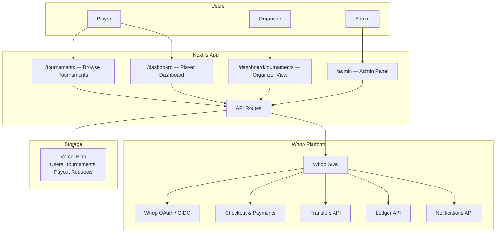
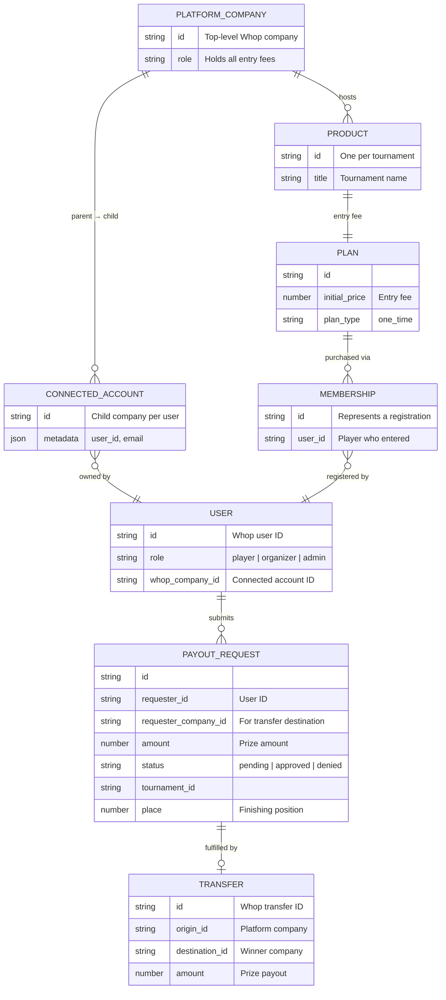
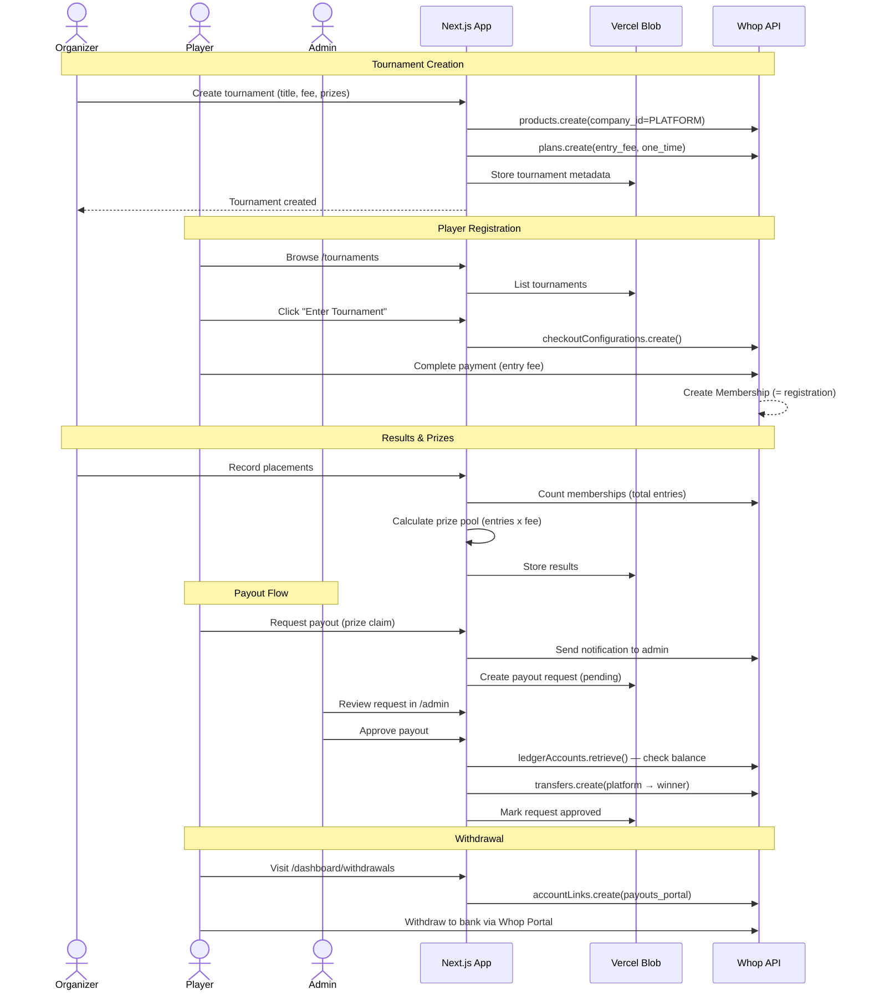
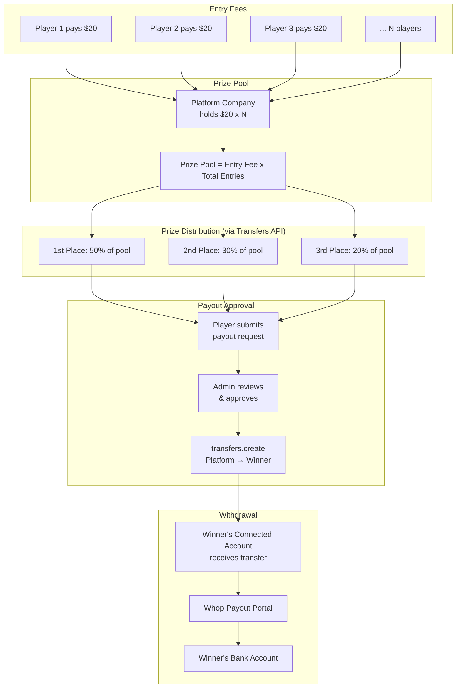

# Titled Tuesday

Online chess tournament platform built on Whop. Organizers create tournaments, players enter via embedded checkout, and prize payouts flow through admin-approved transfers.

**Stack:** Next.js 15 (App Router) | React 19 | TypeScript | Tailwind CSS 4 | Whop SDK | Vercel Blob

---

## Architecture Overview



---

## Whop Features Used

### Connected Accounts (Companies)

Every user gets a **child company** under the platform's parent company. Created lazily on first access via `companies.create()`. The user's role (player or organizer) is stored locally in Vercel Blob, not in company metadata (which is immutable after creation).

- `companies.create()` — Register new player/organizer connected accounts
- `companies.list({ parent_company_id })` — Find existing account by user

### Products (Tournaments)

Each tournament is a **Product** on the platform company. Tournament metadata (title, date, entry fee, max players, status, results) is stored in Vercel Blob alongside the Whop product ID.

- `products.create()` — Create a tournament product on the platform
- `products.update()` — Update tournament details

### Plans (Entry Fees)

Each tournament gets a **one-time Plan** attached to its product. The plan's `company_id` is the platform company, so all entry fees land in the platform account — not the organizer's.

- `plans.create()` — Create the entry fee plan for a tournament

### Checkout Configurations (Tournament Entry)

Embedded checkout handles player registration. A checkout configuration is created server-side (validating capacity and tournament status), then rendered client-side via `<WhopCheckoutEmbed>`.

- `checkoutConfigurations.create()` — Generate a checkout session

### Memberships (Player Registration)

A membership is created when a player completes checkout. Membership count equals registered player count, which determines the prize pool.

- `memberships.list({ product_ids })` — Count players per tournament, check registration status

### Transfers (Prize Payouts)

When an admin approves a payout request, the platform transfers prize money to the winner's connected account. Uses `idempotence_key` set to the payout request ID to prevent double-transfers.

- `transfers.create()` — Execute platform-to-winner transfer
- `transfers.list()` — Audit log of all transfers

### Ledger Accounts (Balance)

The admin panel checks the platform's available balance before approving any payout, ensuring sufficient funds exist.

- `ledgerAccounts.retrieve(id)` — Get platform balance

### Notifications (Payout Alerts)

When a player submits a payout request, a push notification fires to the Whop dashboard bell icon. The notification deep-links to the admin request detail page via `rest_path`.

- `notifications.create()` — Push notification with deep link to `/requests/{id}`

### Access Tokens & Account Links (Embedded Payouts)

The withdrawal page uses Whop's embedded payout components (`BalanceElement`, `WithdrawButtonElement`, `WithdrawalsElement`) to show balance, initiate withdrawals, and view history. A hosted payout portal URL is available as a fallback.

- `accessTokens.create({ company_id })` — Generate token for embedded payout UI
- `accountLinks.create()` — Generate hosted payout portal URL

### OAuth / OIDC (Identity)

Authentication via NextAuth v5 with Whop as an OIDC provider. Shared auth configuration from `@whop-examples/auth`.

---

## Data Model



**Blob storage paths:**

| Entity | Path | Description |
|--------|------|-------------|
| Users | `users/{id}.json` | Role, connected account ID, profile |
| Tournaments | `tournaments/{id}.json` | Metadata, status, results |
| Payout Requests | `payout-requests/req_{id}.json` | Claim details, approval status |

---

## Setup

### 1. Clone and install

```bash
git clone https://github.com/whopio/whop-examples.git
cd whop-examples/web
pnpm install
```

### 2. Configure environment variables

```bash
cp apps/titled-tuesday/.env.example apps/titled-tuesday/.env.local
```

Fill in your `.env.local`:

```env
# Whop API (server-side only)
WHOP_API_KEY=sk_live_xxxxx

# Whop App (public)
NEXT_PUBLIC_WHOP_APP_ID=app_xxxxx
NEXT_PUBLIC_WHOP_COMPANY_ID=biz_xxxxx
NEXT_PUBLIC_APP_URL=http://localhost:3003

# Vercel Blob
BLOB_READ_WRITE_TOKEN=vercel_blob_xxxxx

# NextAuth
AUTH_SECRET=xxxxx

# Whop OAuth (optional — only if using custom OIDC config)
WHOP_CLIENT_SECRET=xxxxx
```

### 3. Configure your Whop app

In the [Whop Developer Dashboard](https://whop.com/developer):

1. Create a new app (or use an existing one)
2. Add the redirect URI: `http://localhost:3003/api/auth/callback/whop`
3. Register the app views (see [App Views](#app-views) below)
4. Note your App ID, Company ID, and API key

### 4. Start the dev server

```bash
pnpm --filter titled-tuesday dev
```

The app runs on `http://localhost:3003`.

---

## App Views

Register these views in the Whop Developer Dashboard:

| View | Path | Purpose |
|------|------|---------|
| Public site | `base_url` | Landing page, browse tournaments, sign up |
| Customer hub | `experience_path` | Player dashboard embedded in Whop hub |
| Admin dashboard | `dashboard_path` | Payout approval, embedded in Whop dashboard |

The admin layout is minimal (no nav, no sidebar) — it is designed to be embedded inside the Whop dashboard iframe. Notifications deep-link via `rest_path` to `/requests/{id}`.

---

## User Flows

### Key Flows



### Player Signs Up

1. Visit landing page, click "Sign In"
2. Redirected to Whop OAuth (OIDC via NextAuth)
3. On first access, connected account auto-created with `role: "player"`
4. Redirected to `/tournaments`

### Player Enters a Tournament

1. Browse `/tournaments`, click a tournament card
2. View details: name, entry fee, prize pool, date/time, player count, capacity
3. Click "Enter Tournament" — embedded checkout modal opens
4. Server validates tournament is `upcoming` and has capacity
5. Player completes payment via `<WhopCheckoutEmbed>`
6. All funds land in the platform account
7. Membership created = player registered

### Player Requests Payout

1. Visit `/dashboard/payouts`, see claimable prize amounts
2. Click "Request Payout" for a tournament result
3. Payout request stored in Vercel Blob (`payout-requests/req_{id}.json`)
4. Push notification fires to admin's Whop dashboard bell icon
5. Request status: `pending`

### Player Withdraws to Bank

1. Visit `/dashboard/withdrawals`
2. Embedded payout components show balance, withdraw button, and history
3. Click withdraw to transfer funds from connected account to bank

### Organizer Creates a Tournament

1. Visit `/dashboard/tournaments`, click "Create Tournament"
2. Fill form: name, description, date, time, entry fee, max players
3. Server creates Product on platform company + one-time Plan for entry fee
4. Tournament appears in public browse listing

### Admin Approves Payout

1. Notification appears in Whop dashboard bell icon
2. Click notification — opens `/admin/requests/{id}` inside Whop iframe
3. View requester info, amount, tournament details, platform balance
4. Click "Approve" — balance checked, transfer executed from platform to winner
5. Winner can now withdraw from their connected account

---

## Money Flow



**Key difference from Masterclass:** In Masterclass, payments go directly to instructor connected accounts with an `application_fee`. In Titled Tuesday, **all** entry fees go to the platform company, and prize payouts are manual transfers approved by an admin. The platform keeps the implicit margin (entry fees collected minus prizes distributed).

---

## API Routes

| Route | Method | Purpose |
|-------|--------|---------|
| `/api/auth/[...nextauth]` | GET/POST | NextAuth handler (Whop OIDC) |
| `/api/connected-account` | GET/POST/PATCH | Find, create, or update connected accounts |
| `/api/tournaments` | GET | List tournaments with membership counts |
| `/api/tournaments/[id]` | GET | Get tournament details |
| `/api/checkout` | POST | Create checkout config (validates capacity + status) |
| `/api/organizer/tournaments` | POST/GET/PATCH/DELETE | Tournament CRUD (organizer only) |
| `/api/organizer/tournaments/results` | POST | Record placements and prize amounts |
| `/api/payout-requests` | GET/POST | List or create payout requests + notification |
| `/api/payout-requests/[id]` | GET | Get payout request details |
| `/api/admin/payout-requests/approve` | POST | Check balance + execute transfer |
| `/api/admin/payout-requests/deny` | POST | Deny with reason |
| `/api/admin/transfers` | GET | Transfer audit log |
| `/api/admin/balance` | GET | Platform balance |
| `/api/payouts/token` | GET | Access token for embedded payout components |
| `/api/payouts/portal` | GET | Hosted payout portal URL |
| `/api/webhooks/whop` | POST | Webhook handler (logging only) |

---

## Common Pitfalls

These are implementation gotchas discovered while building this app.

### 1. Port conflicts cause silent 404s

If another app is already running on your configured port, Next.js silently increments to the next port. But your OAuth redirect URI and `NEXT_PUBLIC_APP_URL` still point to the original port, so every callback and API call 404s. Always verify the actual running port matches your env vars.

### 2. OAuth redirect URI must be registered

The OAuth code can be perfect, but if the redirect URI (`http://localhost:3003/api/auth/callback/whop`) isn't registered in the Whop Developer Dashboard, the flow silently fails. This is a config step, not a code fix.

### 3. Company metadata is not updatable after creation

The `become-organizer` flow originally tried to update the connected account's `metadata.role` via the SDK. This fails — `metadata` is not updatable after creation. **Workaround:** Store user roles in Vercel Blob (`users/{id}.json`) instead of relying on company metadata.

### 4. Membership errors can silently skip tournaments

The tournament listing calls `memberships.list({ product_ids })` to get player counts. If this throws (e.g., invalid product, permissions) and the error is caught in a broad `try/catch`, tournaments silently disappear from the list. **Fix:** Isolate the membership count in its own `try/catch` so a failure only zeroes out the count, not the entire tournament.

### 5. Checkout requires exact parameter shape

Creating a checkout configuration requires `mode: "payment"` with an inline `plan` object. The SDK types don't surface all required fields — when in doubt, match a working example exactly rather than trusting the TypeScript types.

### 6. The common thread

The Whop SDK types don't always match the API's actual requirements. Metadata isn't updatable after creation (but nothing warns you). `company_id` is required for checkout but not in the types. `memberships.list` can fail silently. Most bugs came from assuming the TypeScript types told the full story. When something doesn't work, check the raw API behavior, not just the types.
