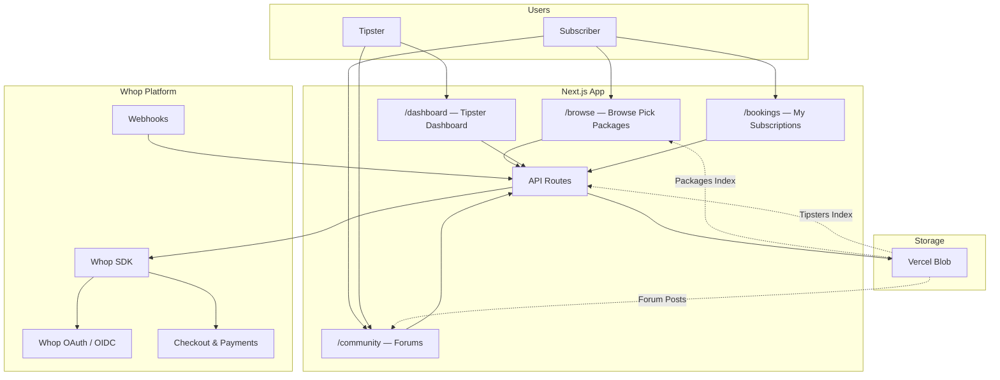

# Winners Club

A two-sided marketplace where tipsters sell pick packages and subscribers buy them — powered entirely by Whop for auth, payments, and payouts. No database required.

`Next.js 15` `Whop SDK` `Whop OIDC` `NextAuth v5` `Vercel Blob` `Tailwind CSS 4`

## Architecture Overview



The app is **standalone** (not embedded inside Whop). It uses Whop as its auth provider and payment backend. There is no traditional database — all persistent state lives in the Whop API (products, plans, memberships, companies) with Vercel Blob as a denormalized read cache and community forum storage.

## Whop Features Used

### Connected Accounts (Companies API)

Every tipster gets their own Whop company, created as a **child** of the platform company. This enables each tipster to have their own products, plans, memberships, and payout balance.

- `companies.create` — Create a connected account on first sign-in
- `companies.list` — Find existing accounts by `parent_company_id`
- `companies.retrieve` / `companies.update` — Read and update tipster metadata (plan tier, sports categories)

### Products & Plans (Catalog API)

Each pick package is a Whop **product**. Package metadata (date, time, pick count, price) is stored as JSON in the product's `description` field.

- `products.create` / `products.update` — CRUD for pick packages
- `products.list` — Fetch a tipster's packages
- `plans.create` — Attach one-time pricing to a product

### Checkout with Application Fees

Buying a pick package creates a **checkout configuration** under the tipster's connected account. The platform takes a cut via `application_fee_amount` — 8% for Core tipsters, 5% for Pro.

- `checkoutConfigurations.create` — Generate a payment link with split payments

### Memberships (Subscription Verification)

A Whop **membership** is created when a subscriber completes checkout. The app queries memberships to show subscription history.

- `memberships.list` — List a subscriber's purchased packages across all tipster accounts

### Embedded Payouts

Tipsters manage their earnings through Whop's embedded payout components. The app generates scoped access tokens and portal URLs.

- `accessTokens.create` — Generate a token for the embedded payout UI (`BalanceElement`, `WithdrawButtonElement`, `WithdrawalsElement`)
- `accountLinks.create` — Generate a hosted payout portal URL

### OAuth / OIDC (Authentication)

Authentication uses Whop as an OIDC provider through NextAuth v5. A shared `@whop-examples/auth` package configures the Whop provider with PKCE.

### Webhooks

The app listens for Whop webhook events to handle plan tier changes and log payment activity.

- `payment.succeeded` / `payment.failed` — Persisted to blob for audit
- `membership.went_valid` — Upgrades tipster to Pro tier
- `membership.went_invalid` — Downgrades tipster to Core tier
- `payout.completed` — Persisted to blob for audit

### Community Forums

The community page stores forum posts in Vercel Blob, providing a discussion space for picks, strategies, and results.

## Setup

### 1. Clone and install

```bash
git clone https://github.com/whopio/whop-examples.git
cd whop-examples/web
pnpm install
```

### 2. Create a Whop App

1. Go to the [Whop Developer Dashboard](https://whop.com/apps)
2. Create a new app
3. Note your **App ID** (this is the OAuth `client_id`) and **API Key**
4. Set the authorized redirect URI:
   ```
   http://localhost:3003/api/auth/callback/whop
   ```

### 3. Configure environment variables

Create `web/apps/winners-club/.env.local`:

```env
# Required
WHOP_API_KEY=your_whop_api_key
AUTH_SECRET=any_random_string_for_nextauth
BLOB_READ_WRITE_TOKEN=your_vercel_blob_token
NEXT_PUBLIC_WHOP_APP_ID=your_whop_app_id
NEXT_PUBLIC_WHOP_COMPANY_ID=your_whop_company_id
NEXT_PUBLIC_APP_URL=http://localhost:3003

# Optional — needed for Pro tier features
WHOP_CLIENT_SECRET=your_whop_client_secret
WHOP_PLAN_PRO_MONTHLY=plan_id_from_setup_script
WHOP_PLAN_PRO_YEARLY=plan_id_from_setup_script
```

### 4. Create tipster plans (optional)

If you want the Core/Pro tier system, run the setup script:

```bash
cd web/apps/winners-club
npx tsx scripts/setup-plans.ts
```

This creates a "Winners Club Tipster Plans" product with Core (free), Pro Monthly ($19/mo), and Pro Yearly ($150/yr) plans. Add the output plan IDs to your `.env.local`.

### 5. Configure webhooks

In your Whop app settings, add a webhook endpoint:

```
https://your-domain.com/api/webhooks/whop
```

Subscribe to: `payment.succeeded`, `payment.failed`, `membership.went_valid`, `membership.went_invalid`, `payout.completed`

### 6. Run the dev server

```bash
cd web/apps/winners-club
pnpm dev
```

The app runs on [http://localhost:3003](http://localhost:3003).

## App Views

| Route | Description | Auth Required |
|---|---|---|
| `/` | Landing page | No |
| `/browse` | Browse all available pick packages | No |
| `/community` | Community forum discussions | No (posting requires auth) |
| `/auth/login` | Whop OAuth sign-in | No |
| `/become-a-tipster` | Tipster onboarding flow | Yes |
| `/upgrade/pro` | Upgrade to Pro tier ($19/mo or $150/yr) | Yes |
| `/bookings` | Subscriber's purchased packages | Yes |
| `/dashboard` | Tipster dashboard overview | Yes |
| `/dashboard/sessions` | Manage pick packages (CRUD) | Yes |
| `/dashboard/payouts` | View balance and withdraw earnings | Yes |
| `/dashboard/profile` | Edit tipster profile and sports categories | Yes |

Middleware protects all `/dashboard/*` routes, redirecting unauthenticated users to `/auth/login`.
